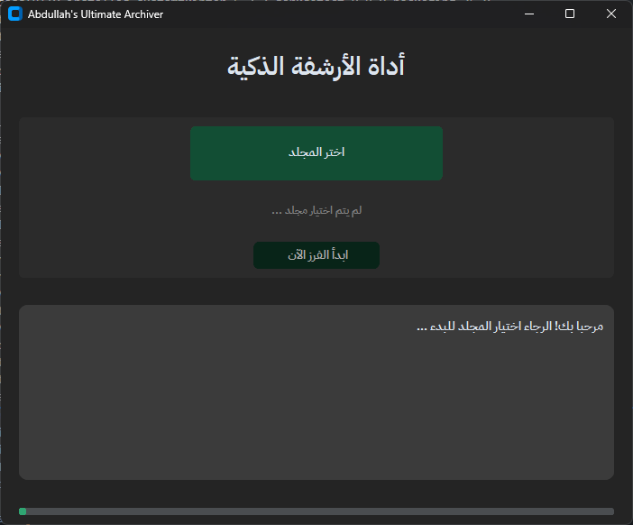

# Abdullah Archiver

A GUI tool to organize invoices and automatically rename files.

## Features
- Read invoice files from a selected folder
- Rename files using consistent naming patterns
- Speed up archiving and search

## Screenshot

## How to Run
1. Install Python 3.10 or newer.
2. Create and activate a virtual environment on Windows:
   - python -m venv .venv
   - .\\.venv\\Scripts\\Activate.ps1
3. Install dependencies:
   - pip install -r requirements.txt
4. Run the app:
   - python main.py

## Build EXE (Optional)
- pyinstaller --onefile --windowed main.py

## Author
Abdullah
